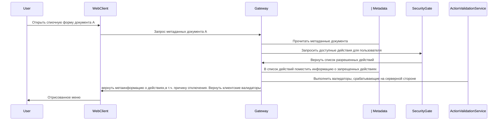
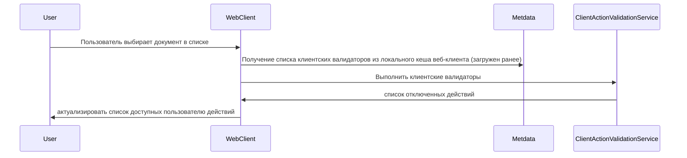
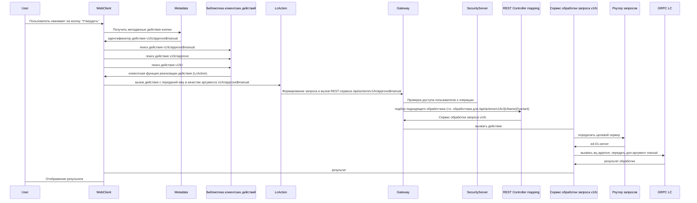

Концептуально отделяем кнопку (как элемент интерфейса) от действия (вызываемой операции). Действие может быть привязано к нескольким кнопкам. Действие может быть привязано вообще не к кнопке. Под действием будем понимать совокупность выполняемых операций на клиенте и сервере, объединенных общей задачей.

Сознательно идем на следующие ограничения

1.  к компоненту (кнопке) не должно быть привязано несколько действий. Это позволяет оставить за пределами рассмотрения сценарии: как рассчитывать доступность, как передавать данные от одного действия к другому и тд
    
2.  в рамках действия может происходить несколько обменов с сервером, но все они происходят в рамках одной группы API
    

### Клиентская часть.

Учитывая текущий опыт переиспользования интерфейсов, большая вероятность что последующие проекты, построенные на платформе будут реализовывать собственный слой представления UI поверх протоколов (API) бэка. В связи с этим видится максимально неспецифичное описание клиентского действия. Предполагаю наличие следующих атрибутов действия:

-   код действий. Может быть задан в виде иерархии, когда требуется однотипно обработать действия одного вида, например lc/sendDocument, где lc - группа, sendDocument - конкретное действие. Простые действия могут не использовать группы, могут использовать какой-то стандартный набор групп, например sign/sign, sign/verify - действия по проверке подписей, либо stdactions/sign, stdactions/singVerify, либо sign, signVerify. Пока не вижу доводов в пользу того или иного подхода, детали реализации. Код действия так же может включать версию реализации этого действия, например, v1/lc/sendDocument, v2/sign. Такой подход позволит постепенно изменять поведение действий.
    
-   описание действия. полезно для вывода в качестве текста кнопки или всплывающей подсказки
    
-   клиентские параметры действия. Параметры, которые будут переданы вместе с описанием кнопки на фронт
    
-   серверные параметры действия. Параметры, которые не передаются на фронт и используются в момент исполнения действия на бэке
    
-   валидаторы - контроллеры доступности кнопок. Указывается список клиентских/серверных контроллеров доступности кнопки
    

На клиентской стороне для каждого действия/группы действий реализован обработчик. В задачи обработчика входит:

-   организовать диалог с пользователем, если необходимо. В т.ч. формы ввода значений могут быть заданы параметром клиентского действия. В этом случае клиент осуществляет загрузку дескриптора формы, указанного в параметрах с бэка и отображение пользователю.
    
-   организовать вызов бэкенда (опционально). Клиентский код действия подготавливает данные (об этом ниже) для отправки на бэк в соответствии с заложенным в это действие алгоритмом и осуществляет один или несколько вызовов бэка. При этом URL для обращения к бэкенду всегда формируются по следующему алгоритму строго в следующем порядке:
    

-   стандартный префикс /api/actions/
    
-   идентификатор действия
    
-   спец-символ ($ или @) + опциональные компоненты пути, определяемые постановкой на реализацию обработчика
    

-   отображение результатов. После завершения всех действий клиентский код отрисовывает результат выполнения операции в соответствии с постановкой на конкретную операцию
    
-   повторный вызов. В случае ошибки выполнения операции на бэке клиент должен либо предоставить пользователю возможность повторить выполнение операции, либо осуществить повторную обработку самостоятельно. В любом сценарии состав отправленных на сервер данных в случае повторной отправки должен быть идентичен составу при первичной отправке. Другими словами, осуществляя вызов бэкенда клиент сохраняет все данные запроса до момента успешного завершения вызова. Если в рамках операции осуществлялось несколько раундов взаимодействия с сервером, то все они должны быть выполнены повторно в том порядке, в котором запускались изначально ***(тут спорно, нужно понять сценарии. В большинстве случаев выглядит так, что нужно повторять только последнее действие)***
    

Протокол взаимодействия:

1.  Заголовки. Клиент осуществляет передачу следующих заголовков на бэк, для каждого из вызовов, осуществляемых в ходе исполнения операции:
    

-   X_PID(processInstanceId). Уникальный идентификатор процесса. Должен быть сформирован один раз на каждое выполняемое действие. Если в рамках обработчика выполняется несколько вызовов бэка, то все вызовы происходят с одним и тем же processInstanceId. Если операция выполняется повторно, то она выполняется с тем же processInstanceId
    
-   X_ORG/X_USER(userOrg/userId). Идентификатор организации, пользователя. Возможно, эти данные необходимо получать из сессии СБ на портале
    
-   X_START_TIME (startTime). Время начала выполнения операции (т.е. момент нажатия пользователем на кнопку). Должно выставляться для каждого вызова бэка. Всегда используется текущее время клиента в формате UTC. Генерируется в начале выполнения действия и передается со всеми запросами на сервер в рамках одного действия без изменения.
- X_REQUEST_START_TIME. Время начала выполнения запроса на сервер. Всегда используется текущее время клиента в формате UTC. В случае повторных вызовов рассчитывается заново. 
    
-   X_DOC_TYPE (вид документа). Код вида документа, над которым производится действие
    
-   X_LOCATION (местонахождение в системе). Пункт меню в дереве навигации (идентификатор)
    
-   X_CLIENT_ID. Идентификатор клиента. Генерируется один раз и сохраняется в local storage. Не меняется от вызова к вызову
    
 - X_REQUEST_ID. Идентификатор конкретного вызова. Генерируется каждый раз заново перед каждым вызовом сервера. **В случае ретрая должен быть сгенерирован заново**
-   Уточнить у Максима про opentracing. Возможно нам нужны traceid/spanid
    

3.  Данные (payload). Данные всегда передаются в виде объекта при помощи метода POST.
    
4.  Файлы
    

### Примерный агоритм работы клиента

1.  Пользователь нажимает на кнопку "Передать на исполнение". К кнопке привязано действие v1/lc/to-execution
    
2.  Фронт разбивает идентификатор действия на группы, подбирая готовое действие среди библиотеки доступных действий js-кода (часть кода фронта). Поиск обработчика действия осуществляется от наиболее конкретного к наиболее общему. В данном примере вначале ищется обработчик, для v1/lc/to-execution, затем обработчик v1/lc, затем v1. В данном примере предполагаем что на бэке есть обработчик группы действий v1/lc
    
3.  Фронт запрашивает данные у пользователя (если это определено алгоритмом работы действия)
    
4.  Фронт готовит данные для вызова бэка. В т.ч. формирует и сохраняет необходимые заголовки и тело пакета. Фронт также формирует URI для обращения на сервер. В данном пример /api/actions/v1/lc/to-execution
    
5.  Фронт осуществляет вызов сервер и ожидание ответа. Если в результате выполнения операции фронт получает ошибки:
    

-   500, 502, 503, 504, 429, 408 то осуществляется попытка повторного вызова
    
-   400 - сообщаем об ошибке пользователю. Предлагаем сформировать обращение в службу поддержки. При этом обязательно осуществляем передачу заголовков с которыми был сформирован запрос и URI на который запрос отправлялся
    
-   403 - сообщаем, что у пользователя нет прав на выполнение операции
    
-   410 - сообщаем, что такая операция не найдена. Предлагаем обратиться в службу поддержки. При этом обязательно осуществляем передачу заголовков с которыми был сформирован запрос и URI на который запрос отправлялся
    

  

# Серверная часть

## Gateway

  

Задачи gateway:

-   провалидировать доступ пользователя к действию:
    

-   gateway определяет что пользователь запросил выполнение действия ( запрос пришел на /api/actions/
    
-   определяет идентификатор действия. Для этого:
    

-   из URI удаляется /api/actions/
    
-   берется подстрока между началом строки и символом ? (параметры запроса)
    
-   берется подстрока между началом строки и спец-символом (@ или $)
    

-   по полученному идентификатору действия обращается в ПОИБ с целью проверки доступности действия пользователю (есть смысл кешировать на непродолжительное время)
    

-   определить целевой сервер
    

-   тут, возможно, есть смысл заложить категорию действий, которые нецелесообразно передавать на бэк и можно выполнить на GW. В качестве варианта можно заложиться на то, что идентификатор действия имеет группу gw/. Примером такого действия может быть проверка наличия вложения или получение информации об организации и тд. нужно сказать, что этот пункт исключение из правил. В целом, возлагать задачу определения бэкенд сервера на URL неправильно, т.к. это дырявая абстракция и знание о внутреннем устройстве системы утекает наружу.
    
-   В качестве альтернативы предыдущему способу можно рассмотреть создание более конкретного URL-мэпинга для каких-то действий. Например, есть общий мэпинг на /api/actions, который действует по алгоритму изложенному в следующих пунктах. А есть мэпинг на /api/actions/some-func-action, который, очевидно, будет иметь приоритет над первым.
    
-   по заголовку X_DOC_TYPE восстанавливается вид документа. Либо по заголовку X_LOCATION.
    
-   по виду документа определяется целевой сервер на который отправить запрос.
    

-   отправить запрос. На целевой сервер отправляется запрос выполнения действия. Используем grpc. Payload пересылаем в виде строки, файлы как массив байт  (тут сразу вопрос к размеру файлов, либо закладываться на стриминг grpc). В ответ сервер присылает массив байт и кодировку ответа, либо код ошибки. Ошибка транслируется в HTTP-ошибку. Массив байт отдается в качестве ответа:
    

-   ошибка отсутствия действия в 410 ошибку
    
-   ошибка таймаутов в 408
    
-   ошибка отсутсвия доступа к действию в 403
    
-   ошибка отсутствия данных о пользователи в 401
    
-   остальные в 500
    

  

## Целевой сервер

Целевой сервер получает запрос на выполнение операции через GRPC. В запросе идут все данные переданные клиентом (grpc streaming?). Далее сервер подбирает бин, реализующий определенный интерфейс и имеющий идентификатор == идентификатору действия. Т.к. идентификатор действий иерархический, то: вначале подбираем наиболее конкретный бин, далее менее конкретный и т.д. Отброшенные компоненты пути передаются найденному обработчику. Если обработчик не найден возвращаем ошибку. Если найден - вызываем его, передавая всю полученную информацию. Тут важно придти к контракту метода максимально похожему на написание REST-контроллеров. Это позволит в дальнейшем (если потребуется) перейти на REST взаимодействие в обход grpc. Т.е. видится так, что нужно обрабатывать мэпинги @Controller, @RequestMapping, обрабатывать аннотации @PathVariable, @RequestBody и др.

Открытый вопрос, нужно ли на целевом сервере проводить повторный контроль допустимости исполнения операции. Мне видится что нет.  Решить вопрос с ИБ

Целевой сервер формирует ответ на попытку выдать действие. Информация, которая может быть включена в ответ видится следующей:

-   допустимость выполнения действия: Допустимо, Отклонено валидатором, Отклонено компонентом ИБ.
    
-   признак наличия ошибки, в т.ч. с классификатором ошибки (допускает повторное выполнение/не допускает) и кодом ошибки для передачи в службу поддержки
    
-   формат результата: сообщение, данные (payload), файл, коллекция файлов, информация об отложенном исполнении (т.е. результат появится позже)
    
-   содержимое результата (определяется форматом результата)
    

## Валидаторы

Валидаторы или контроллеры доступности кнопок определяют когда кнопки необходимо отключить. По умолчанию считаем что все кнопки доступны. Валидаторы не проверяют политики безопасности и делятся на несколько групп: клиентские (рассчитываются на клиенте), смешанные (клиентские и серверные), серверные. Примеры валидаторов:

-   selection/selected - отключает кнопку, если нет выбранных документов. Данную проверку не возможно выполнить на бэке, т.к. бэк не хранит репрезентативное состояние (т.е. не знает что отображено клиенту). Это клиентский валидатор
    
-   condition/fields - проверяет условия для полей документа. Может быть выполнено как на фронте, так и на gateway. Тут важно заложить какой-то минимальный формат условия, парсинг которого будет лекго реализовать и на фронте и на бэке (json-path ?)
    
-   condition/user/has_role - проверяет условие наличие роли у пользователя. Выполнять такое на фронте не имеет смысла, т.к. мы обязаны будем перепроверить данные на бэке.
    

В целом видится, что нужно сформировать минимальную библиотеку валидаторов исходя из текущих потребностей и прорабатывать ее отдельно.

  

## Алгоритм взаимодействия клиент и бэка в части работы с мета-описанием действий

1.  Бэк обращается к фронту для получения списка действий для разных меню визуальной формы. Бэк читает .menu и формирует ответ фронту, внося следующие корректировки:
    

-   у СБ запрашивается список доступных действий над документом для конкретного субъекта и запрещенные действия отмечаются как "Запрещено к выполнению". Действие при этом не исключается из списка, передается на фронт. На фронте элементы управления, к которым привязаны такие действия должны быть недоступны для взаимодействия, всплывающая подсказка должна уточнять причину недоступности - "Запрещено политикой безопасности". Запрошенные политики имеет смысл кешировать на непродолжительное время (пару минут)
    
-   Для действия выполняются серверные и клиент-серверные валидаторы, имеющие смысл на данном этапе. Например, проверить что пользователь входит в какую-то роль можно на этом этапе. А вот убедиться что поле документа имеет определенное значение нельзя, т.к. никакого документа еще не загружено. Как вариант, такие классы валидаторов отмечать специальным интерфейсом на бэке. Отключенные действия также пересылаются на клиента с пометкой "отключено условием".
    
-   список действий пересылается на клиента, в т.ч. к действиям добавляется описание клиентских и клиент-серверных валидаторов
    
-   фронт, получив список действий вычисляет условия, которые возможно вычислить на данном этапе
    
      
    

### ЖЦ Валидатора.

На фронте будет лежать ответственность за периодический вызов валидаторов во время работы пользователя с системой. Часть валидаторов (проверка выбран ли документ, выбрана ли строка таблицы) обсчитывается когда пользователь выполняет действия в определенной области (таблице), часть валидаторов (проверка условия по полям) обсчитывается когда пользователь или система изменяет поле на форме и т.д. 
**Важный момент** непонятно, нужно ли обсчитывать серверные валидаторы в процессе работы клиента с формой (возможно, достаточно их обсчитать при вызове действия). Однако, если такой сценарий будет востребован, то в обязательном порядке необходимо сделать пакетную обработку - т.е. фронт обращается к беку с просьбой рассчитать доступность ВСЕХ кнопок для такого-то контекста (документа, папки).

Диаграмма получения доступных действий клиентом
-


Диаграмма обновления доступности кнопок на клиенте
-


Диаграмма обработки вызова действия пользователем
-

 [Link to diagram](https://mermaid-js.github.io/mermaid-live-editor/view/#eyJjb2RlIjoic2VxdWVuY2VEaWFncmFtXG5cdFVzZXIgLT4-IFdlYkNsaWVudDog0J_QvtC70YzQt9C-0LLQsNGC0LXQu9GMINC90LDQttC40LzQsNC10YIg0L3QsCDQutC90L7Qv9C60YMgXCLQo9GC0LLQtdGA0LTQuNGC0YxcIlxuXHRXZWJDbGllbnQgLT4-IE1ldGFkYXRhOiDQn9C-0LvRg9GH0LjRgtGMINC80LXRgtCw0LTQsNC90L3Ri9C1INC00LXQudGB0YLQstC40Y8g0LrQvdC-0L_QutC4XG5cdE1ldGFkYXRhIC0-PiBXZWJDbGllbnQ6INC40LTQtdC90YLQuNGE0LjQutCw0YLQvtGAINC00LXQudGB0YLQstC40Y8gdjEvbGMvYXBwcm92ZSRtYW51YWxcblx0V2ViQ2xpZW50IC0-PiDQkdC40LHQu9C40L7RgtC10LrQsCDQutC70LjQtdC90YLRgdC60LjRhSDQtNC10LnRgdGC0LLQuNC5OiDQv9C-0LjRgdC6INC00LXQudGB0YLQstC40Y8gdjEvbGMvYXBwcm92ZSRtYW51YWxcblx0V2ViQ2xpZW50IC0-PiDQkdC40LHQu9C40L7RgtC10LrQsCDQutC70LjQtdC90YLRgdC60LjRhSDQtNC10LnRgdGC0LLQuNC5OiDQv9C-0LjRgdC6INC00LXQudGB0YLQstC40Y8gdjEvbGMvYXBwcm92ZVxuXHRXZWJDbGllbnQgLT4-INCR0LjQsdC70LjQvtGC0LXQutCwINC60LvQuNC10L3RgtGB0LrQuNGFINC00LXQudGB0YLQstC40Lk6INC_0L7QuNGB0Log0LTQtdC50YHRgtCy0LjRjyB2MS9sYy9cblx00JHQuNCx0LvQuNC-0YLQtdC60LAg0LrQu9C40LXQvdGC0YHQutC40YUg0LTQtdC50YHRgtCy0LjQuSAtPj4gV2ViQ2xpZW50OiDQutC70LjQtdC90YLRgdC60LDRjyDRhNGD0L3QutGG0LjRjyDRgNC10LDQu9C40LfQsNGG0LjQuCDQtNC10LnRgdGC0LLQuNGPIChMY0FjdGlvbilcblx0V2ViQ2xpZW50IC0-PiBMY0FjdGlvbjog0LLRi9C30L7QsiDQtNC10LnRgdGC0LLQuNGPINGBINC_0LXRgNC10LTQsNGH0LXQuSDQtdC80YMg0LIg0LrQsNGH0LXRgdGC0LLQtSDQsNGA0LPRg9C80LXQvdGC0LAgdjEvbGMvYXBwcm92ZSRtYW51YWxcblx0TGNBY3Rpb24gLT4-IEdhdGV3YXk6INCk0L7RgNC80LjRgNC-0LLQsNC90LjQtSDQt9Cw0L_RgNC-0YHQsCDQuCDQstGL0LfQvtCyIFJFU1Qt0YHQtdGA0LLQuNGB0LAgL2FwaS9hY3Rpb25zL3YxL2xjL2FwcHJvdmUkbWFudWFsXG5cdEdhdGV3YXkgLT4gU2VjdXJpdHlTZXJ2ZXI6INCf0YDQvtCy0LXRgNC60LAg0LTQvtGB0YLRg9C_0LAg0L_QvtC70YzQt9C-0LLQsNGC0LXQu9GOINC6INC-0L_QtdGA0LDRhtC40Lhcblx0R2F0ZXdheSAtPj4gUkVTVCBDb250cm9sbGVyIG1hcHBpbmc6INC_0L7QtNCx0L7RgCDQv9C-0LTRhdC-0LTRj9GJ0LXQs9C-INC-0LHRgNCw0LHQvtGC0YfQuNC60LAgKNGCLtC1LiDQvtCx0YDQsNCx0L7RgtGH0LjQutCwINC00LvRjyAvYXBpL2FjdGlvbnMvdjEvbGMve2xjTmFtZX0ve3ZhcmlhbnR9XG5cdFJFU1QgQ29udHJvbGxlciBtYXBwaW5nIC0-PiBHYXRld2F5OiDQodC10YDQstC40YEg0L7QsdGA0LDQsdC-0YLQutC4INC30LDQv9GA0L7RgdCwIHYxL2xjXG5cdEdhdGV3YXkgLT4g0KHQtdGA0LLQuNGBINC-0LHRgNCw0LHQvtGC0LrQuCDQt9Cw0L_RgNC-0YHQsCB2MS9sYzog0LLRi9C30LLQsNGC0Ywg0LTQtdC50YHRgtCy0LjQtVxuXHTQodC10YDQstC40YEg0L7QsdGA0LDQsdC-0YLQutC4INC30LDQv9GA0L7RgdCwIHYxL2xjIC0-PiDQoNC-0YPRgtC10YAg0LfQsNC_0YDQvtGB0L7Qsjog0L7Qv9GA0LXQtNC10LvQuNGC0Ywg0YbQtdC70LXQstC-0Lkg0YHQtdGA0LLQtdGAXG5cdCDQoNC-0YPRgtC10YAg0LfQsNC_0YDQvtGB0L7QsiAtPj4g0KHQtdGA0LLQuNGBINC-0LHRgNCw0LHQvtGC0LrQuCDQt9Cw0L_RgNC-0YHQsCB2MS9sYzogZWQtMDEtc2VydmVyXG5cdCDQodC10YDQstC40YEg0L7QsdGA0LDQsdC-0YLQutC4INC30LDQv9GA0L7RgdCwIHYxL2xjIC0-PiBHUlBDIExDOiDQstGL0LfQstCw0YLRjCDQttGGIGFwcHJvdmUsINC_0LXRgNC10LTQsNGC0Ywg0LTQvtC_LdCw0YDQs9GD0LzQtdC90YIgbWFudWFsXG5cdCBHUlBDIExDIC0-PiDQodC10YDQstC40YEg0L7QsdGA0LDQsdC-0YLQutC4INC30LDQv9GA0L7RgdCwIHYxL2xjOiDRgNC10LfRg9C70YzRgtCw0YIg0L7QsdGA0LDQsdC-0YLQutC4XG5cdCDQodC10YDQstC40YEg0L7QsdGA0LDQsdC-0YLQutC4INC30LDQv9GA0L7RgdCwIHYxL2xjIC0-IFdlYkNsaWVudDog0YDQtdC30YPQu9GM0YLQsNGCXG5cdCBXZWJDbGllbnQgLT4gVXNlcjrQntGC0L7QsdGA0LDQttC10L3QuNC1INGA0LXQt9GD0LvRjNGC0LDRgtCwICIsIm1lcm1haWQiOiJ7XG4gIFwidGhlbWVcIjogXCJkZWZhdWx0XCIsXG4gIFwidXNlTWF4V2lkdGhcIjogXCJ0cnVlXCJcbn0iLCJ1cGRhdGVFZGl0b3IiOnRydWUsImF1dG9TeW5jIjp0cnVlLCJ1cGRhdGVEaWFncmFtIjp0cnVlfQ)

Возможные действия, группы:
- 
- v1/lc/имя_действия_ЖЦ (эктора) - выполняет действие ЖЦ, заданное последним компонентом пути
- v1/sign/sign - подписание документа
- v1/sign/verify - проверка подписи документа
 

## Концепция действия по работе с отчетами
Тут фиксирую видение как бы могло быть реализовано действие по формированию печатных форм. В условиях отсутствия детализации бизнес-составляющей задачи делаю следующие допущения:

- точное поведение действия (и будет ли оно частным для каждого отчета в отдельности или общим для неск отчетов) должно быть предоставлено БА
- далее предполагаю простой сценарий при котором пользователю выводится диалог с вводами каких-то параметров
- заполненые данные передаются на сервер, где вызывается обработчик формирования отчета
- в ответ приходит файл отчета

Возможное описание действия (далее демнострация концепции а не спецификация формата описания):
```xml
<action id="v1/reports/incomeDocReport">
  <client-validators>
	  <!-- Включаем действие если не выбран никакой документ -->
	  <validator id="not-selected"/>
  </client-validators>
  <client-params>
	  <param name="form-template">
	  <!-- указываем где взять json для этой формы. Фронт из этого параметра сделает URL вида /static/forms/common/report_two_fields.json -->
	     <f:string>common/report_two_fields</f:string>
	  </param>
  </client-params>
</action>
 ```
на клиенте реализован обработчик для группы действий v1/reports
```js
val allActions = { "v1/reports" : function() {....} }

fun lookupAction(acionId) {
	//разбить строку v1/reports/incomdeDocReport на части, и поискать наличие обработчика.
	for (x in ["v1/reports/incomeDocReport", "v1/reports", "v1"] {
	   if x in allActions return allActions[x]
	}
	return null;
}
```
функция, которая зарегистрирован под ключом v1/reports:

1. Скачивает дескриптор формы, переданный параметром form-template
2. Отображает форму клиенту
3. Получает введенные данные и формирует JSON объект
4. Осуществляет вызов REST POST /api/actions/v1/reports$incomeDocReport и передает JSON  объект в виде тела запрос

На стороне gateway реализован фильтр вида
```kotlin
//обрабатыем все вызовы на /api/actions, определяем вызываемый action, спрашиваем у СБ можно ли
route().path("/api/actions/")
	.filter((request, next) -> {
		val actionId = request
			.removeStart("/api/actions/")
			.substringBefore("$")
		checkUserActionPermision(actionId, userId)
	}
```
и обработчик генерации отчетов вида
```kotlin
@PostMapping(path = "/api/actions/v1/reports/{reportId}", consumes = "application/json")
fun generateReport(@PathVariable reportId: String, @Body payload: ReportParams) : ReponseEntity {
	return applicationContext
		.getBean<ReportGenerator>(reportId)
		.generate(payload)
}
```
